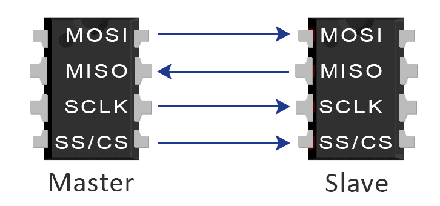
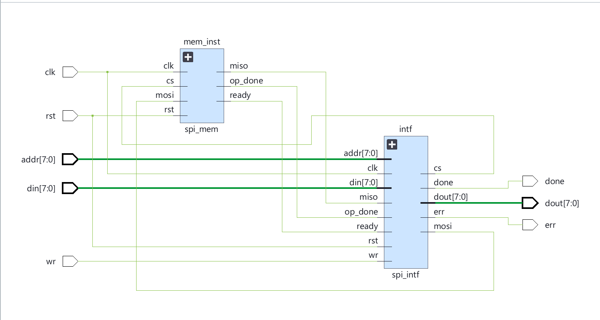

# SPI (Serial Peripheral Interface)

The Serial Peripheral Interface (SPI) is a synchronous serial communication protocol used primarily for short-distance communication in embedded systems. It utilizes a master-slave architecture where the master device initiates data frames. SPI relies on four fundamental logic signals: SCLK (Clock), MOSI (Master Out Slave In), MISO (Master In Slave Out), and CS (Chip Select). It is widely used across the industry for interfacing microcontrollers with sensors, memory chips, and other peripheral devices due to its simplicity, high speed, and reliability.

## SPI Master State Transition Table

| Current State | Condition / Event | Next State | Actions / Operations Performed |
|---------------|-------------------|------------|--------------------------------|
| **idle** | Unconditional | **load** | `cs = 1`, `mosi = 0`, clear `done` and `err` |
| **load** | Unconditional | **check_op** | Latch `{din, addr, wr}` into `din_reg` |
| **check_op** | `wr == 1` && `addr < 32` | **send_data** | Assert `cs = 0` (Begin write operation) |
| **check_op** | `wr == 0` && `addr < 32` | **read_data1** | Assert `cs = 0` (Begin read operation) |
| **check_op** | `addr >= 32` | **error** | Keep `cs = 1` (Invalid address detection) |
| **send_data** | `count <= 16` | **send_data** | Shift `din_reg` bit onto `mosi`, `count++` |
| **send_data** | `count > 16` && `op_done == 1` | **idle** | Raise `cs = 1`, assert `done = 1`, `count = 0` |
| **send_data** | `count > 16` && `op_done == 0` | **send_data** | Raise `cs = 1`, wait for slave `op_done` |
| **read_data1** | `count <= 8` | **read_data1** | Shift address/op bit onto `mosi`, `count++` |
| **read_data1** | `count > 8` | **check_ready**| Raise `cs = 1`, clear `count = 0` |
| **check_ready** | `ready == 1` | **read_data2** | Acknowledge slave is ready to transmit data |
| **check_ready** | `ready == 0` | **check_ready**| Wait for slave's `ready` signal |
| **read_data2** | `count <= 7` | **read_data2** | Shift `miso` bit into `dout_reg`, `count++` |
| **read_data2** | `count > 7` | **idle** | Assert `done = 1`, clear `count = 0` |
| **error** | Unconditional | **idle** | Assert `err = 1`, `done = 1` |

## SPI Slave State Transition Table

| Current State | Condition / Event | Next State | Actions / Operations Performed |
|---------------|-------------------|------------|--------------------------------|
| **idle** | `cs == 0` | **detect** | Master initiated transaction (`cs` asserted) |
| **idle** | `cs == 1` | **idle** | Wait for master, clear `mosi, ready, op_done` |
| **detect** | `miso == 1` | **store** | Decode Write operation from first bit |
| **detect** | `miso == 0` | **send_addr** | Decode Read operation from first bit |
| **store** | `count <= 15` | **store** | Shift `miso` into `datain` register, `count++` |
| **store** | `count > 15` | **idle** | Write `datain[15:8]` to `mem[datain[7:0]]`, set `op_done = 1` |
| **send_addr** | `count <= 7` | **send_addr** | Shift `miso` (address bits) into `datain`, `count++` |
| **send_addr** | `count > 7` | **send_data** | Assert `ready = 1`, prefetch `mem[datain]` into `dataout` |
| **send_data** | `count < 8` | **send_data** | Clear `ready`, shift `dataout` bit onto `mosi`, `count++` |
| **send_data** | `count >= 8` | **idle** | Set `op_done = 1`, clear `count = 0` |

## SPI Top-Level Design

