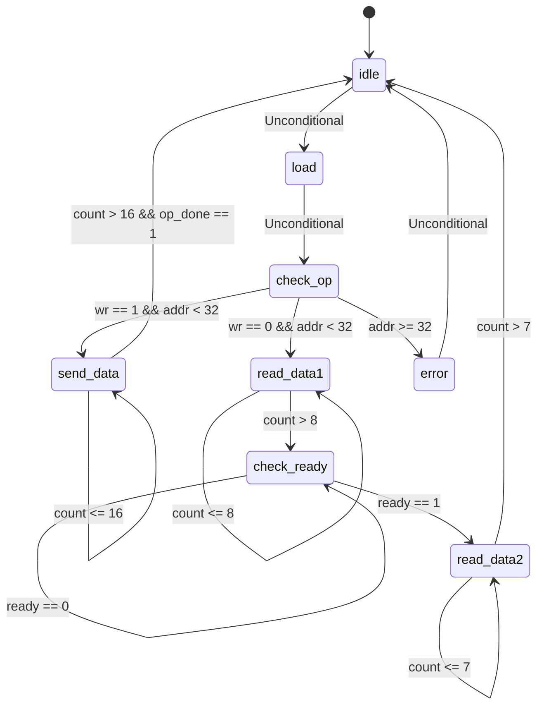
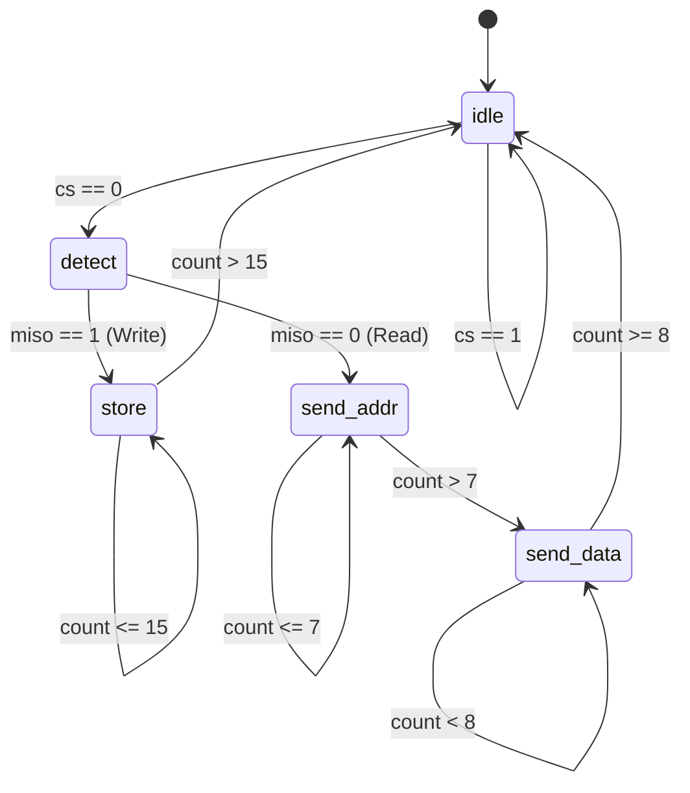

# SPI System FSM Documentation

This document provides an industry-standard breakdown of the Finite State Machines (FSMs) for both the SPI Master (`spi_intf`) and SPI Slave (`spi_mem`) modules. 

## 1. SPI Master (`spi_intf`) FSM

The SPI Master handles the transmission sequences. It checks if an operation is valid, shifts data out serially over MOSI, and reads data back over MISO depending on the user's write/read flag (`wr`).

### State Transition Diagram

### State Transition Table

| Current State | Condition / Event | Next State | Actions / Operations Performed |
|---------------|-------------------|------------|--------------------------------|
| **idle** | Unconditional | **load** | `cs = 1`, `mosi = 0`, clear `done` and `err` |
| **load** | Unconditional | **check_op** | Latch `{din, addr, wr}` into `din_reg` |
| **check_op** | `wr == 1` && `addr < 32` | **send_data** | Assert `cs = 0` (Begin write operation) |
| **check_op** | `wr == 0` && `addr < 32` | **read_data1** | Assert `cs = 0` (Begin read operation) |
| **check_op** | `addr >= 32` | **error** | Keep `cs = 1` (Invalid address detection) |
| **send_data** | `count <= 16` | **send_data** | Shift `din_reg` bit onto `mosi`, `count++` |
| **send_data** | `count > 16` && `op_done == 1` | **idle** | Raise `cs = 1`, assert `done = 1`, `count = 0` |
| **send_data** | `count > 16` && `op_done == 0` | **send_data** | Raise `cs = 1`, wait for slave `op_done` |
| **read_data1** | `count <= 8` | **read_data1** | Shift address/op bit onto `mosi`, `count++` |
| **read_data1** | `count > 8` | **check_ready**| Raise `cs = 1`, clear `count = 0` |
| **check_ready** | `ready == 1` | **read_data2** | Acknowledge slave is ready to transmit data |
| **check_ready** | `ready == 0` | **check_ready**| Wait for slave's `ready` signal |
| **read_data2** | `count <= 7` | **read_data2** | Shift `miso` bit into `dout_reg`, `count++` |
| **read_data2** | `count > 7` | **idle** | Assert `done = 1`, clear `count = 0` |
| **error** | Unconditional | **idle** | Assert `err = 1`, `done = 1` |

---

## 2. SPI Slave (`spi_mem`) FSM

The SPI Slave acts as an external memory component. It stays in an idle state monitoring the Chip Select (`cs`) line. Once selected, it decodes the command (Read/Write) and accesses its internal register array.

### State Transition Diagram

### State Transition Table

| Current State | Condition / Event | Next State | Actions / Operations Performed |
|---------------|-------------------|------------|--------------------------------|
| **idle** | `cs == 0` | **detect** | Master initiated transaction (`cs` asserted) |
| **idle** | `cs == 1` | **idle** | Wait for master, clear `mosi, ready, op_done` |
| **detect** | `miso == 1` | **store** | Decode Write operation from first bit |
| **detect** | `miso == 0` | **send_addr** | Decode Read operation from first bit |
| **store** | `count <= 15` | **store** | Shift `miso` into `datain` register, `count++` |
| **store** | `count > 15` | **idle** | Write `datain[15:8]` to `mem[datain[7:0]]`, set `op_done = 1` |
| **send_addr** | `count <= 7` | **send_addr** | Shift `miso` (address bits) into `datain`, `count++` |
| **send_addr** | `count > 7` | **send_data** | Assert `ready = 1`, prefetch `mem[datain]` into `dataout` |
| **send_data** | `count < 8` | **send_data** | Clear `ready`, shift `dataout` bit onto `mosi`, `count++` |
| **send_data** | `count >= 8` | **idle** | Set `op_done = 1`, clear `count = 0` |

## 3. Signal and Variable Dictionary (`spi.sv`)

This section documents every input, output, wire, and internal register across all modules in `spi.sv` to clarify their specific roles in the architecture.

### 3.1 SPI Master (`spi_intf`)

#### Inputs:
*   `wr`: Control flag. `1` indicates a Write transaction; `0` indicates a Read transaction.
*   `clk`: The main system clock.
*   `rst`: Active-high synchronous reset.
*   `ready`: Handshake signal from the slave indicating the read data has been fetched from memory and is ready to transmit.
*   `op_done`: Handshake signal from the slave indicating the entire operation has finished.
*   `addr`: 8-bit bus carrying the target memory address.
*   `din`: 8-bit bus carrying the data to be written (only used if `wr == 1`).
*   `miso`: (Master In, Slave Out). The serial line receiving data from the slave.

#### Outputs:
*   `dout`: 8-bit bus containing the final data successfully read from the slave.
*   `cs`: (Chip Select). Active-low serial control line indicating a transaction is in progress.
*   `mosi`: (Master Out, Slave In). The serial line transmitting data to the slave.
*   `done`: High for one cycle when the Master has successfully finished the transaction.
*   `err`: High for one cycle if an invalid transaction was requested (e.g. Address >= 32).

#### Internal Registers/Variables:
*   `din_reg`: A 17-bit shift register. In the `load` state, it captures the `{din, addr, wr}` bits so they can be shifted out serially.
*   `dout_reg`: An 8-bit shift register. It captures the serial bits arriving on `miso` during a Read transaction.
*   `count`: An integer counter used to track how many bits have been shifted out or shifted in during serial transmission states.
*   `state`: A 3-bit enumerated register holding the current FSM state of the Master.

### 3.2 SPI Slave Memory (`spi_mem`)

#### Inputs:
*   `clk`: The main system clock.
*   `rst`: Active-high synchronous reset.
*   `cs`: Chip Select from the Master.
*   `mosi`: Serial data line arriving from the Master.

#### Outputs:
*   `ready`: Pulses high for one cycle during a Read to tell the Master to start sampling `miso`.
*   `miso`: Serial data line transmitting data back to the Master.
*   `op_done`: Pulses high for one cycle when the memory write or memory read sequence is completely finished.

#### Internal Registers/Variables:
*   `mem`: An unpacked array of 32 8-bit registers representing the physical RAM of the slave.
*   `i`: An integer used strictly for the `initial` block loop to clear the memory array to 0.
*   `count`: An integer counter used to track the number of bits shifted in or out.
*   `datain`: A 16-bit shift register. During operations, it captures the serial `mosi` line. It will eventually hold either `{data, address}` (for Writes) or just `{address}` (for Reads).
*   `dataout`: An 8-bit register holding the prefetched read data from `mem` right before shifting it out onto `miso`.
*   `state`: A 3-bit enumerated register holding the current FSM state of the Slave.

### 3.3 Top-Level Wrapper (`top`)

#### Wires (Interconnects):
*   `csreg`: Connects the Master's `cs` output to the Slave's `cs` input.
*   `mosireg`: Connects the Master's `mosi` output to the Slave's `mosi` input.
*   `misoreg`: Connects the Slave's `miso` output to the Master's `miso` input.
*   `readyreg`: Connects the Slave's `ready` output to the Master's `ready` input.
*   `opdonereg`: Connects the Slave's `op_done` output to the Master's `op_done` input.

### 3.4 Verification Interface (`spi_i`)
*   Contains the exact same external port definitions (`wr`, `clk`, `rst`, `addr`, `din`, `dout`, `done`, `err`) bundled as a SystemVerilog `interface` block, which can be utilized by UVM/SystemVerilog testbenches for easier port mapping.
